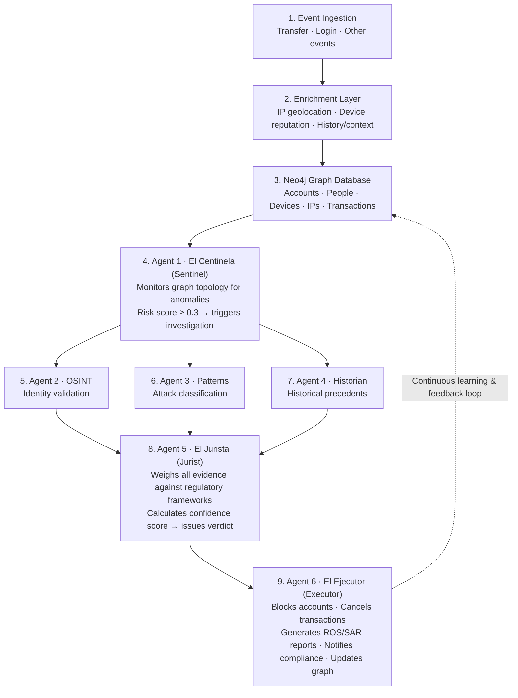

# NEXUS — Sentinel Swarm

**Autonomous Risk Operating System (AROS) for real-time financial fraud detection.**

Nexus (codename *Sentinel Swarm*) is an AI-powered fraud detection platform for banks in Latin America. It combines graph-based analysis, multi-agent AI orchestration, and open banking data to detect, investigate, and act on financial fraud in real time — surfaced through a compliance-analyst decision platform (this repo's frontend) on top of a 6-agent detection pipeline (this repo's backend).

> **Status: functional proof-of-concept / research project.** It demonstrates how modern AI agent architectures can be applied to financial crime detection. It is not production-ready and should not be used with real customer data without security hardening, compliance review, and regulatory approval — see [Limitations](#limitations).

---

## Table of Contents

- [What it does](#what-it-does)
- [Architecture](#architecture)
- [The 6 agents](#the-6-agents)
- [Fraud patterns detected](#fraud-patterns-detected)
- [Application walkthrough (UI)](#application-walkthrough-ui)
- [Tech stack](#tech-stack)
- [Getting started](#getting-started)
- [Project structure](#project-structure)
- [API reference](#api-reference)
- [Roles & permissions (RBAC)](#roles--permissions-rbac)
- [Regulatory framework](#regulatory-framework)
- [How scoring works](#how-scoring-works)
- [Limitations](#limitations)
- [Contributing](#contributing)
- [License](#license)

---

## What it does

Nexus processes banking events (transfers, logins, password changes, device links) through a pipeline of 6 specialized AI agents that collaborate to detect fraud patterns, assess risk, and recommend an action — all in under 15 seconds — then hands the result to a human compliance analyst through the dashboard shown below.

```
Banking Event → Enrichment → Graph Analysis → 6 AI Agents → Recommendation → Analyst Decision
```

---

## Architecture




### Four layers

```
┌──────────────────────────────────────────────────┐
│  INGESTION          Apache Kafka                 │
│  Events from core banking → enrichment pipeline  │
├──────────────────────────────────────────────────┤
│  GRAPH              Neo4j + GDS                  │
│  Nodes: Person, Account, Device, IP, Transaction  │
│  Algorithms: Louvain, PageRank, Betweenness,      │
│              Jaccard similarity                   │
├──────────────────────────────────────────────────┤
│  AI MULTI-MODEL                                   │
│  Llama-3 70B (local, PII-safe)                    │
│  GPT-4o (OSINT, NLP)                              │
│  Claude Opus (legal reasoning)                    │
│  Embeddings (RAG vector store)                    │
├──────────────────────────────────────────────────┤
│  ORCHESTRATION      LangGraph                     │
│  6 agents, conditional branching, timeouts        │
│  Full pipeline < 15 seconds                       │
└──────────────────────────────────────────────────┘
```

### Multi-tenant

Each bank gets isolated data (separated by `tenant_id` in the graph) but shares anonymized intelligence across tenants: cross-bank IP/device correlations, shared fraud pattern signatures, and anonymized topology features for model training. Cross-tenant analytics in the UI are gated to the Admin role (see [RBAC](#roles--permissions-rbac)).

---

## The 6 agents

| # | Agent | Role | Model |
|---|-------|------|-------|
| 1 | **El Centinela** (The Sentinel) | Continuous graph monitoring. Detects ring attacks, smurfing networks, synthetic identities, velocity anomalies, bridge nodes, suspicious action chains, and proximity to blocked accounts. | Llama-3 70B |
| 2 | **El Investigador OSINT** (The Stalker) | External identity validation — email/phone/IP checks, breach databases, identity coherence. | GPT-4o |
| 3 | **El Arquitecto de Patrones** (Pattern Matcher) | Classifies attack type against a library of 7 known fraud topologies using structural similarity. | Llama-3 70B |
| 4 | **El Historiador Forense** (Memory Keeper) | Searches a RAG vector database of closed cases for similar precedents and historical fraud rates. | Embeddings + Llama-3 70B |
| 5 | **El Jurista** (The Judge) | Evaluates all evidence against UY/AR regulatory frameworks, calculates a weighted confidence score, and issues a **recommendation** — DISCARD / MONITOR / ESCALATE / BLOCK — for a human analyst to act on. | Claude Opus |
| 6 | **El Ejecutor** (The Executor) | The only agent with write permissions. Blocks accounts, cancels transactions, generates ROS reports, notifies compliance, and updates the graph. | Llama-3 70B |

---

## Fraud patterns detected

- **Smurfing / Structuring** — breaking large amounts into smaller transfers to avoid reporting thresholds
- **Account Takeover** — device link → password change → drain transfer chain
- **Synthetic Identity** — fabricated identities sharing devices/IPs across multiple accounts
- **Layering** — cascading transfers through 4–8 layers to obscure fund origin
- **Round-Tripping** — circular transfers between related entities
- **Card Carousel** — coordinated card fraud across multiple accounts
- **Insurance Fraud** — bipartite graph patterns in claims

---

## Application walkthrough (UI)

The frontend is the analyst-facing decision layer on top of the pipeline above. Screenshots referenced below live in `docs/screenshots/` — copy your `Alert_Queue.png`, `Dashboard.png`, `Graph_explorer.png`, `Endpoint_graph.png`, and `Tennat_management.png` there for these to render on GitHub.

### 1. Alerts Queue — the analyst's home screen


The default landing screen for a Compliance Analyst. Top strip shows four live counters — Inbox Queue, Critical Alerts, Consolidated Cases, Resolved/Closed. Below that, an **Advanced Queue Filters** bar lets an analyst narrow the worklist by verdict, jurisdiction (UY/AR), tenant bank, a minimum-risk slider, and a free-text client/ID search.

The **Active Worklist** table is the core of the screen: each row is one case, showing Case ID, Tenant Bank, Client / ID Document, the detected fraud Pattern (badge-coded — SMURFING, ROUND_TRIPPING, ACCOUNT_TAKEOVER, LAYERING, etc.), a combined Risk/Confidence bar, the Evaluated Amount in local currency, the agent swarm's Recommendation (color-coded: red BLOCK, orange ESCALATE, yellow MONITOR, green DISCARD), and an action column — either **Take Case** or an "Assigned to: …" label if it's already claimed. A **Sync Queue** button refreshes the list against the backend.

The left sidebar (present on every screen) shows the active role via a **role simulator dropdown** — used here to demo RBAC without a real login system — and primary navigation: Alerts Queue, Manager Dashboard, Graph Explorer, and under Administration: Bank Settings/Multi-Tenant and Alert Simulator.

### 2. Manager Dashboard — executive/KPI view


A consolidated, cross-bank statistics view for Compliance Managers. KPI cards up top: Estimated Alert Amount (with week-over-week trend), Average Swarm Risk, Global Confidence Interval (labeled by the current agent-precision model version), and Evaluated Cases in the last 24h with the pipeline's SLA (<15s). A bank selector at the top-right toggles between "All Banks (Consolidated)" and a single tenant.

Below the KPIs: a **Verdict Distribution** donut chart (BLOCK/ESCALATE/MONITOR/DISCARD counts), a **Typological Models & Patterns** bar chart showing volume per fraud pattern, and a **Fraud Trend History** line chart tracking alert/resolution volume over the last 7 days.

### 3. Graph Explorer — network investigation


The graph-analysis workspace, scoped to one bank at a time via the selector at the top-right. A **Specialized Views** panel on the left switches the rendered dataset between: Full Bank Graph, Contaminated Nodes, Transfer Flows, Shared Devices & IPs, Cycle Detection, and Community Detection (the last backed by the Louvain GDS algorithm, per the label in the UI).

Two features are intentionally gated and shown as locked in the screenshot:
- **Cross-Tenant Analytics (Interbank)** — requires the Network Administrator role
- **Cypher Query Console (GDS Neo4j)** — labeled "Admin/Senior only," a raw query surface into the graph

The main panel renders the network itself — a force-directed graph with a color/icon-coded legend (Account/CBU/Card, Device/Hardware Fingerprint, IP Address/Network, Merchant/ATM Location).


Clicking any node opens a detail panel — the example above shows an Account node ("Eduardo S. Rodríguez") with its Risk Score (94%) and Connection Type, plus a hint that nodes can be dragged to manually reposition the topology. Node size/border color scales with risk, so high-risk accounts, devices, and IPs are visually obvious at a glance (e.g. the TOR exit IP and the target account both render with heavier red borders in this case).

### 4. Tenant & Bank Entity Management — admin configuration


Where an Admin registers and configures each participating bank. The **Register New Bank / Regulated Entity** form captures the commercial bank name, country jurisdiction (Uruguay/BCU or Argentina/UIF·BCRA — extensible to other LATAM countries), the applicable compliance regulatory framework (e.g. "BCU Circular 315/2022"), and a **Risk Tolerance Threshold** slider — alerts scoring above this threshold are auto-flagged critical for that bank.

Registered banks render as cards below the form: bank name, tenant ID, country badge, regulation reference, current alert threshold, creation date, and edit/delete actions. This is also where per-bank verdict thresholds (Monitor/Escalate/Block cutoffs) should live as the platform matures — see [How scoring works](#how-scoring-works).

---

## Tech stack

| Component | Technology |
|-----------|-----------|
| Backend API | FastAPI (Python 3.12) |
| Agent orchestration | LangGraph |
| Graph database | Neo4j 5.x + Graph Data Science |
| Event streaming | Apache Kafka (KRaft mode) |
| Cache | Redis 7 |
| Vector store | ChromaDB |
| LLMs | OpenAI GPT-4o, Anthropic Claude, Llama-3 70B, Google Gemini (frontend AI features) |
| Open banking | Prometeo API |
| Frontend | React/Vite (built via Google AI Studio), TypeScript |
| Graph visualization | Force-directed network view (vis.js-style) |
| Legacy dashboard | Streamlit (`dashboard.py`, prototype) |
| Containerization | Docker Compose |

---

## Getting started

### Backend

**Prerequisites:** Python 3.12+, Docker Desktop, and (optional for demo mode) API keys for OpenAI, Anthropic, and Prometeo.

```bash
git clone <backend-repo-url>
cd nexus-backend

# Manual setup
python3.12 -m venv .venv
source .venv/bin/activate
pip install -e ".[dev]"
pip install streamlit plotly httpx

cp .env.example .env      # add your API keys

docker compose -f docker/docker-compose.yml up -d   # Neo4j, Kafka, Redis, ChromaDB
uvicorn sentinel_swarm.api.app:app --host 0.0.0.0 --port 3000

python seed_massive.py    # load 55,000 test cases (5 banks, optional)
```

Or use the one-command script: `./start.sh` (checks prerequisites, starts Docker, installs deps, and boots the API + legacy dashboard).

### Frontend

**Prerequisites:** Node.js

```bash
git clone <frontend-repo-url>
cd nexus-frontend

npm install
# set GEMINI_API_KEY in .env.local (used for in-app AI features, e.g. narrative generation)
# set NEXT_PUBLIC_API_BASE_URL (or equivalent) to point at the backend, default http://localhost:3000

npm run dev
```

### Access

| Service | URL |
|---------|-----|
| **Frontend** | http://localhost:5173 (or your Vite/Next dev port) |
| **Backend API** | http://localhost:3000 |
| **API Docs (Swagger)** | http://localhost:3000/docs |
| **Neo4j Browser** | http://localhost:7474 |
| **Legacy Streamlit dashboard** | http://localhost:8501 |

---

## Project structure

```
nexus/
├── backend/
│   ├── src/sentinel_swarm/
│   │   ├── agents/              # 6 AI agents (sentinel, osint, patterns, historian, jurist, executor)
│   │   ├── api/
│   │   │   ├── app.py           # FastAPI application
│   │   │   ├── deps.py          # Shared state and persistence
│   │   │   └── routes/          # alerts, cases, events, graph, health, prometeo, reports, tenants, training
│   │   ├── config/              # Settings via environment variables
│   │   ├── graph/                # Neo4j client and tenant manager
│   │   ├── ingestion/            # Kafka consumer and enrichment
│   │   ├── integrations/         # Prometeo API client
│   │   ├── models/               # Pydantic data models
│   │   ├── orchestrator/         # LangGraph pipeline
│   │   ├── tools/                # Agent tools (OSINT, graph, compliance, execution)
│   │   └── utils/
│   ├── tests/
│   ├── docker/                   # docker-compose.yml, Neo4j init.cypher
│   ├── dashboard.py              # Streamlit prototype dashboard
│   ├── seed.py / seed_massive.py
│   └── start.sh
├── frontend/
│   ├── src/                      # Alerts Queue, Manager Dashboard, Graph Explorer, Tenant Management, Alert Simulator
│   ├── .env.local                # GEMINI_API_KEY, API base URL
│   └── package.json
└── docs/
    └── screenshots/               # UI reference images used in this README
```

---

## API reference

### Alerts (analyst workflow)

| Method | Endpoint | Description |
|--------|----------|-------------|
| `GET` | `/api/alerts/queue` | Prioritized alert queue with filters |
| `GET` | `/api/alerts/queue/stats` | Queue statistics (pending, critical, etc.) |
| `GET` | `/api/alerts/{case_id}` | Full alert detail with all agent reports |
| `POST` | `/api/alerts/{case_id}/decide` | Record decision: APPROVE / REJECT / ESCALATE |
| `POST` | `/api/alerts/{case_id}/assign` | Assign alert to an analyst |

### Cases

| Method | Endpoint | Description |
|--------|----------|-------------|
| `GET` | `/api/cases/` | List cases with filters (verdict, score, tenant) |
| `GET` | `/api/cases/{id}` | Full case detail |
| `GET` | `/api/cases/{id}/timeline` | Agent execution timeline |
| `GET` | `/api/cases/{id}/agents/{agent}` | Individual agent report |
| `GET` | `/api/cases/stats/summary` | Aggregate statistics |
| `POST` | `/api/cases/import` | Bulk import cases |

### Reports

| Method | Endpoint | Description |
|--------|----------|-------------|
| `GET` | `/api/reports/{case_id}/narrative` | Auto-generated case narrative |
| `GET` | `/api/reports/{case_id}/ros` | Structured ROS/SAR report |
| `GET` | `/api/reports/{case_id}/ros/html` | Printable ROS (HTML → browser Print → PDF) |

### Events

| Method | Endpoint | Description |
|--------|----------|-------------|
| `POST` | `/api/events/process` | Process event through the 6-agent pipeline |
| `POST` | `/api/events/process/bulk` | Process multiple events |

### Graph exploration

| Method | Endpoint | Description |
|--------|----------|-------------|
| `GET` | `/api/graph/{tid}/full` | Full graph for a tenant |
| `GET` | `/api/graph/{tid}/subgraph/{node}` | Neighborhood around a node |
| `GET` | `/api/graph/{tid}/contaminated` | Nodes connected to fraud (risk spread) |
| `GET` | `/api/graph/{tid}/transfers` | Transfer flow graph |
| `GET` | `/api/graph/{tid}/shared-resources` | Shared devices/IPs across accounts |
| `GET` | `/api/graph/{tid}/cycles` | Circular transfer detection |
| `GET` | `/api/graph/{tid}/communities` | Community detection (Louvain) |
| `POST` | `/api/graph/{tid}/query` | Raw Cypher query — **Admin only** |
| `GET` | `/api/graph/cross-tenant/compare` | Cross-bank shared connections — **Admin only** |

### Tenants (banks)

| Method | Endpoint | Description |
|--------|----------|-------------|
| `GET` | `/api/tenants/` | List all banks |
| `POST` | `/api/tenants/` | Register a new bank |
| `GET` | `/api/tenants/{id}` | Bank details |
| `PATCH` | `/api/tenants/{id}` | Update configuration |
| `DELETE` | `/api/tenants/{id}` | Delete bank and all its data |
| `GET` | `/api/tenants/{id}/stats` | Graph statistics for a bank |

### Prometeo (open banking) & Training (cross-tenant intelligence)

See the full endpoint list in [`backend/README.md`](backend/README.md) — 15+ Prometeo endpoints (login, accounts, movements, transfers, enrollment) and 4 training endpoints for anonymized cross-tenant fraud intelligence.

---

## Roles & permissions (RBAC)

The frontend simulates roles via the sidebar dropdown ("Simular Rol Analista") ahead of real authentication being wired into the backend (see [Limitations](#limitations)). Current gating, per the UI:

| Role | Alerts Queue | Manager Dashboard | Graph Explorer | Cross-Tenant Analytics | Cypher Console | Tenant Management |
|---|---|---|---|---|---|---|
| **Compliance Analyst (L1)** | ✅ full | view | ✅ (own bank) | ❌ locked | ❌ locked | ❌ |
| **Senior Analyst** | ✅ full | view | ✅ full | ❌ locked | ❌ locked | ❌ |
| **Compliance Manager** | view | ✅ full | ✅ full | ❌ locked | ❌ locked | view |
| **Network Administrator** | ✅ full | ✅ full | ✅ full | ✅ unlocked | ✅ unlocked | ✅ full CRUD |

---

## Regulatory framework

| Country | Regulations |
|---------|------------|
| **Uruguay** | Ley 19.574, BCU, SENACLAFT, UIAF |
| **Argentina** | Ley 25.246/26.683, BCRA Com. A 6399, UIF |
| **International** | GAFI/GAFILAT, OFAC, UN, EU sanctions |

- Documents: Cedula (UY), DNI (AR)
- Account identifiers: CBU/CVU
- Reports: ROS (Reporte de Operación Sospechosa)
- ROS destinations: UIAF (Uruguay), UIF (Argentina)

---

## How scoring works

### Confidence score

```
C = (W_sentinel * S_sentinel + W_osint * S_osint + W_patterns * S_patterns
     + W_historian * S_historian + W_jurist * S_jurist) / sum(weights)
```

### Verdicts / recommendations

| Score | Recommendation | Suggested action |
|-------|-----------------|-------------------|
| < 0.40 | DISCARD | Auto-dismiss |
| 0.40 – 0.65 | MONITOR | Watch 72 hours |
| 0.65 – 0.85 | ESCALATE | Send to human analyst |
| ≥ 0.85 | BLOCK | Analyst confirms block + ROS |

> The Jurist agent issues a **recommendation**, not a final decision — every BLOCK/ESCALATE still routes through the analyst's Decision Panel in the Alerts Queue / Case View before any action is taken.

### Risk multipliers

| Factor | Multiplier |
|--------|-----------|
| Amount > USD 10,000 | ×1.20 |
| Account < 30 days old | ×1.10 |
| VPN/TOR connection | ×1.15 |
| GAFI high-risk destination | ×1.20 |
| GAFI grey-list destination | ×1.15 |
| PEP (Politically Exposed Person) | ×1.10 |
| Sanctions list match | ×1.20 |
| Client > 5 years, no incidents | ×0.90 |
| Client > 2 years, no incidents | ×0.80 |

---

## Limitations

This is a proof of concept. Key limitations:

- **No real LLM calls in demo mode** — agents use rule-based heuristics when API keys are not configured
- **In-memory + JSON persistence** — not a proper database for cases
- **No authentication** — neither the API nor the frontend enforce real auth yet; the role dropdown is a UI simulation, not access control
- **No encryption** — PII is not encrypted at rest
- **No rate limiting** — API endpoints are unprotected
- **Single-node** — no horizontal scaling
- **Kafka is optional** — demo mode bypasses Kafka
- **OSINT is simulated** — the OSINT agent uses heuristics, not live AbuseIPDB/HIBP/PhishTank calls, without real API keys configured

For production: add encryption, authentication (JWT/OAuth), real RBAC enforcement server-side, persistent storage (PostgreSQL), monitoring, and a full security review.

---

## Contributing

Contributions are welcome — please open an issue first to discuss changes. Areas where help is needed:

- Real OSINT integrations (AbuseIPDB, MaxMind, HIBP, PhishTank/OpenPhish for link-redirect checks)
- MITRE ATT&CK technique tagging for credential/access-based fraud patterns
- Threat-intel feed integration (AlienVault OTX, abuse.ch, MISP) for the Historian agent
- Production persistence (PostgreSQL for cases)
- Real authentication and server-side RBAC enforcement
- SOC/EDR integration for Executor response actions (firewall blocklist, AV/EDR triggers, tamper protection)
- Additional fraud patterns and detection rules
- Performance optimization for large graphs
- Support for more LATAM countries (BR, CL, CO, MX, PE)

---

## License

MIT

---

## Acknowledgments

- [LangGraph](https://github.com/langchain-ai/langgraph) — agent orchestration
- [Neo4j](https://neo4j.com/) — graph database and GDS algorithms
- [Prometeo](https://prometeoapi.com/) — open banking API for LATAM
- [Google AI Studio](https://ai.studio/) — frontend scaffolding
- [Streamlit](https://streamlit.io/) — legacy dashboard prototyping

Built as a research project exploring multi-agent AI systems for financial crime detection in Latin America.
